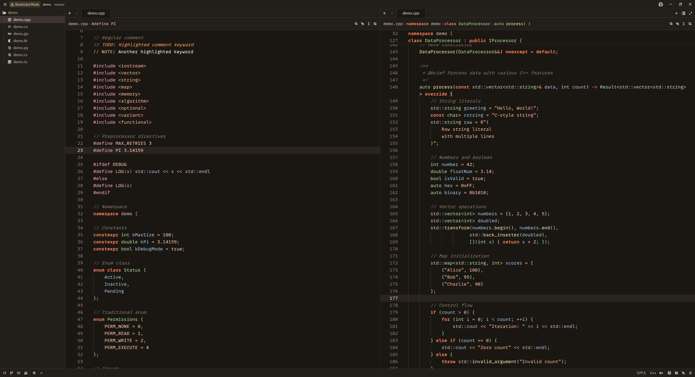

# Rust & Brown

[English](#english) | [Русский](#russian)

---

## English

A warm dark theme for Zed editor with brown tones and orange accents.

### Description

A cozy color scheme designed for comfortable long-term coding sessions. Soft brown shades reduce eye strain, while orange accents add expressiveness to your code.

### Screenshots



### Installation

#### Option 1: Install as Extension (Recommended)

1. Open Zed editor
2. Press `Ctrl+Shift+P` (Windows/Linux) or `Cmd+Shift+P` (macOS)
3. Type `zed: extensions`
4. Search for "Rust & Brown"
5. Click Install

#### Option 2: Manual Installation

1. Clone this repository or download the theme file
2. Copy `themes/rust-and-brown.json` to your Zed themes folder:
   - Windows: `%APPDATA%\Roaming\Zed\themes\`
   - macOS: `~/.config/zed/themes/`
   - Linux: `~/.config/zed/themes/`
3. Restart Zed
4. Open Zed → Settings → Theme → select "Rust & Brown"

#### Option 3: Quick Install (macOS/Linux)

```bash
curl -o ~/.config/zed/themes/rust-and-brown.json https://raw.githubusercontent.com/LukianovII/rust-and-brown/master/themes/rust-and-brown.json
```

#### Option 4: Quick Install (Windows PowerShell)

```powershell
Invoke-WebRequest -Uri "https://raw.githubusercontent.com/LukianovII/rust-and-brown/master/themes/rust-and-brown.json" -OutFile "$env:APPDATA\Zed\themes\rust-and-brown.json"
```

### Color Palette

**Editor**
- Background: `#1a1612`
- Text: `#fffbf5`
- Accent: `#ff8860`
- Muted text: `#d4c5b9`

**Syntax Highlighting**
- Keywords: `#ff8860` (bold)
- Functions: `#ffe8b8`
- Types: `#b8e0a8`
- Variables: `#a8c8e8`
- Strings: `#ffb89d`
- Numbers/Constants: `#ffc8b8`
- Comments: `#8a7d72` (italic)
- Operators: `#ffb090`
- Macros/Decorators: `#ffa8d0`
- Interfaces/Enums: `#a8e0d0`

**Diagnostics**
- Errors: `#ff9090`
- Warnings: `#ffe8b8`
- Success: `#b8e0a8`
- Info: `#a8c8e8`

### Author

LukianovII

### License

MIT

---

## Russian

Тёплая темная тема для Zed с коричневыми тонами и оранжевыми акцентами.

### Описание

Уютная цветовая схема, созданная для комфортной длительной работы. Мягкие коричневые оттенки снижают нагрузку на глаза, а оранжевые акценты добавляют выразительности коду.

### Скриншоты


### Установка

#### Вариант 1: Установка как расширение (Рекомендуется)

1. Откройте Zed
2. Нажмите `Ctrl+Shift+P` (Windows/Linux) или `Cmd+Shift+P` (macOS)
3. Введите `zed: extensions`
4. Найдите "Rust & Brown"
5. Нажмите Install

#### Вариант 2: Ручная установка

1. Клонируйте репозиторий или скачайте файл темы
2. Скопируйте `themes/rust-and-brown.json` в папку тем Zed:
   - Windows: `%APPDATA%\Roaming\Zed\themes\`
   - macOS: `~/.config/zed/themes/`
   - Linux: `~/.config/zed/themes/`
3. Перезапустите Zed
4. Откройте Zed → Settings → Theme → выберите "Rust & Brown"

#### Вариант 3: Быстрая установка (macOS/Linux)

```bash
curl -o ~/.config/zed/themes/rust-and-brown.json https://raw.githubusercontent.com/LukianovII/rust-and-brown/master/themes/rust-and-brown.json
```

#### Вариант 4: Быстрая установка (Windows PowerShell)

```powershell
Invoke-WebRequest -Uri "https://raw.githubusercontent.com/LukianovII/rust-and-brown/master/themes/rust-and-brown.json" -OutFile "$env:APPDATA\Zed\themes\rust-and-brown.json"
```

### Цветовая палитра

**Редактор**
- Фон: `#1a1612`
- Текст: `#fffbf5`
- Акцент: `#ff8860`
- Приглушённый текст: `#d4c5b9`

**Подсветка синтаксиса**
- Ключевые слова: `#ff8860` (жирный)
- Функции: `#ffe8b8`
- Типы: `#b8e0a8`
- Переменные: `#a8c8e8`
- Строки: `#ffb89d`
- Числа/константы: `#ffc8b8`
- Комментарии: `#8a7d72` (курсив)
- Операторы: `#ffb090`
- Макросы/декораторы: `#ffa8d0`
- Интерфейсы/перечисления: `#a8e0d0`

**Диагностика**
- Ошибки: `#ff9090`
- Предупреждения: `#ffe8b8`
- Успех: `#b8e0a8`
- Информация: `#a8c8e8`

### Автор

LukianovII

### Лицензия

MIT
